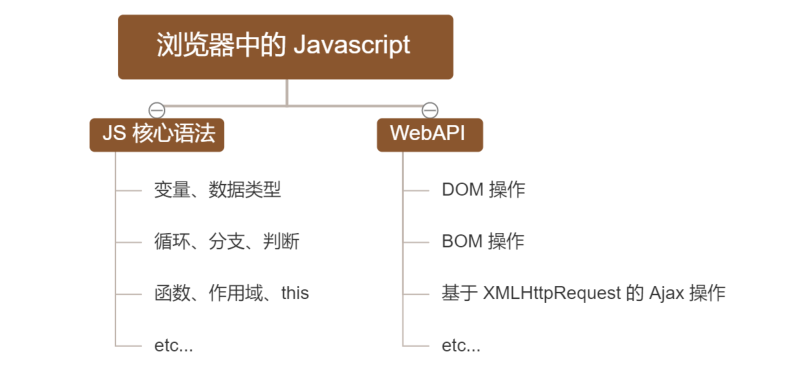
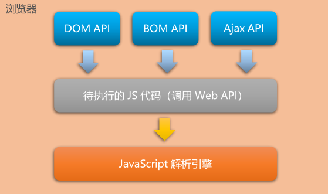
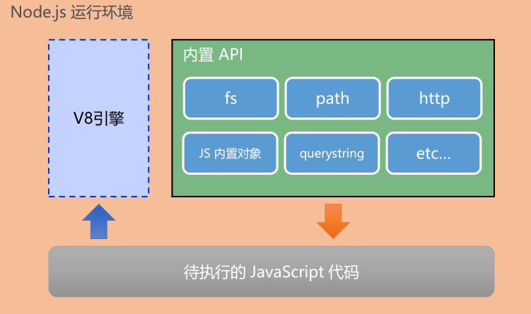
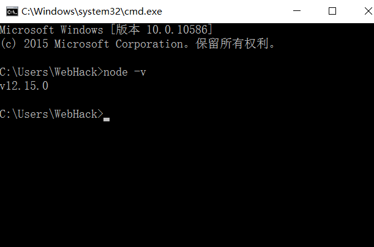
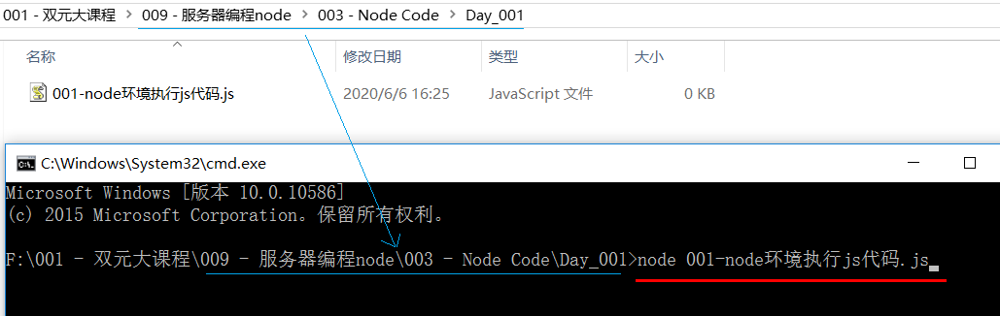

## Node 第 1 天


### 1.  学习目标

◆  能够知道什么是 `Node.js`
◆  能够知道 `Node.js` 可以做什么
◆  能够说出 `Node.js` 中的 `JavaScript` 的组成部分
◆  能够使用 `fs` 模块读写操作文件
◆  能够使用 `path` 模块处理路径
◆  能够使用 `http` 模块写一个基本的 `web` 服务器


---

### 2.  回顾和思考


#### 2.1  为什么 JavaScript 可以在浏览器中执行

##### 2.1.1 已经掌握了哪些技术


##### 2.1.2  浏览器中的 JavaScript 的组成部分




##### 2.1.3  为什么  JavaScript 可以在浏览器中被执行 


#### 2.2  JavaScript 可以操作 `DOM` 和 `BOM`

-  每个浏览器都内置了 `DOM`、`BOM` 这样的 `API` 函数，因此，浏览器中的 `JavaScript` 才可以调用它们。




#### 2.3  浏览器中的 JavaScript 运行环境

运行环境是指代码正常运行所需的必要环境


总结： 

	1.    `V8` 引擎负责解析和执行 `JavaScript` 代码
 	2.    内置 `API` 是由运行环境提供的特殊接口，只能在所属的运行环境中被调用


#### 2.4  JavaScript 能否做后端开发

1.  `JavaScript` 可以做后台开发，只不过需要借助 `Node.js`
2.  `JavaScript` 作为一门语言，代码的执行肯定需要运行环境，浏览器能够解析 `JavaScript` 代码，因为浏览器是一个运行环境，恰好，`Node.js` 也集成了一个 `JavaScript` 运行环境，也可以对 `JavaScript` 代码进行解析，不过 `Node` 是一个后端的运行环境，也是因此 `JavaScript` 能够进行后台的开发


---

### 3.  初识 `Node`

#### 3.1  什么是 `Node`

> 能够了解 Node 是一个运行环境，并不是一门后台语言


​	`Node.js` 是一个基于 `Chrome V8` 引擎的 `JavaScript` 运行环境

​	**Node 实际上就是一个 `JavaScript` 运行环境，它集成了 `v8`  引擎， 从而能对 `JavaScript` 代码进行解析**


#### 3.2 `Node` 中的 `JavaScript` 环境

> 能够知道 Node 运行环境包含哪两个部分
>
> 能够知道 Node 运行环境和 浏览器运行环境的区别


1.  Node 运行环境包含两个部分，分别是：

   - `V8` 引擎，主要负责解析 `JavaScript` 代码
   -  内置 `API`，我们学习 `Node.js` 重点就是学习这些内置的 `API`，从而能够完成后台的开发

   

2.   `Node` 运行环境和 浏览器运行环境的区别

   - 浏览器是 `JavaScript` 的前端运行环境
   - `Node.js` 是 `JavaScript` 的后端运行环境

   -  `Node` 环境中 **没有 `DOM` 和 `BOM` 的 `API`**，即在 `Node` 中无法调用 `DOM` 和 `BOM` 等浏览器内置 `API`

      同理，在浏览器中也不能够调用 `Node` 内置 `API`

     




#### 3.3  Node 学习路径

##### 3.3.1 Node 可以做什么

`Node` 作为一个 JavaScript 的运行环境，仅仅提供了基础的功能和 `API`。然而，基于 `Node` 提供的这些基础能，很多强大
的工具和框架如雨后春笋，层出不穷，所以学会了 `Node` ，可以让前端程序员胜任更多的工作和岗位

1.   基于 [Express 框架](http://www.expressjs.com.cn/)，可以快速构建 `Web` 应用
2.   基于 [Electron 框架](https://electronjs.org/)，可以构建跨平台的桌面应用
3.   基于 [restify 框架](http://restify.com/)，可以快速构建 `API` 接口项目
4.   读写和操作数据库、创建实用的命令行工具辅助前端开发、etc…


##### 3.3.2 Node 学习路径

  JavaScript 基础语法   -->   **`Node.js` 内置 `API` 模块**（`fs`、`path`、`http` 等）  -->   **第三方 `API` 模块**（express、`mysql` 等）


#### 3.4  下载并安装 Node

##### 3.4.1  下载 Node 的方式

1.  如果希望通过 `Node.js` 来运行 `Javascript` 代码，则必须在计算机上安装 `Node.js` 环境才行

2.  安装包在 `Node.js` 官网首页直接[下载](https://nodejs.org/en/)，点击绿色的按钮，下载所需的版本后，双击直接安装即可

   


##### 3.4.2 区分 `LTS` 版本和 Current 版本的不同

1.  **`LTS `为长期稳定版**，对于追求稳定性的企业级项目来说，推荐安装 `LTS` 版本的 `Node.js`
2.  **`Current` 为新特性尝鲜版**，对热衷于尝试新特性的用户来说，推荐安装 `Current` 版本的 `Node.js`。但是，`Current` 版本中可能存在隐藏的 `Bug` 或安全性漏洞，因此不推荐在企业级项目中使用 `Current` 版本的 `Node.js`


#### 3.5  查看已安装的 Node 的版本号

1.  打开终端，在终端输入命令 `node –v` 后，按下回车键，即可查看已安装的 `Node.js` 的版本号

2.  Windows 系统快速打开终端的方式：使用快捷键 (Windows徽标键 + R) 打开运行面板，输入 `cmd` 后直接回车，即可打开终端

   




#### 3.6  什么是终端

1.  终端（英文：Terminal）是专门为开发人员设计的，用于实现人机交互的一种方式
2.  作为一名合格的程序员，我们有必要识记一些常用的终端命令，来辅助我们更好的操作与使用计算机


#### 3.7  Node 环境执行 JavaScript 代码

1.  在项目根目录下打开终端

2.  输入 node 要执行的 `js`文件的路径，例如

   ```js
   node 1.js
   ```

   


#### 3.8  更快捷的打开终端

1.  在文件夹地址栏区域，输入 cmd ，既可以打开终端

   

2.  按照鼠标 shift，同时点击鼠标左键，在此处打开 `powershell`

   


#### 3.9  终端中的快捷键

在 `Windows` 的 `powershell` 或 `cmd` 终端中，我们可以通过如下快捷键，来提高终端的操作效率：

1.  使用 `↑` 键，可以快速定位到上一次执行的命令
2.  使用 `tab` 键，能够快速补全路径
3.  使用 `esc` 键，能够快速清空当前已输入的命令
4.  输入 `cls` 命令，可以清空终端


---

### 4.  `fs` 文件系统


#### 4.1  `fs` 文件系统模块

1.  `fs` 模块是 `Node.js` 官方提供的、用来**操作文件**的模块。它提供了一系列的方法和属性，用来满足用户对文件的操作需求

   - `fs.readFile()` 方法，用来读取指定文件中的内容

   - `fs.writeFile()` 方法，用来向指定的文件中写入内容


 2.   如果要在 `JavaScript` 代码中，使用 `fs` 模块来操作文件，则需要使用如下的方式先导入它

      ```js
      const fs = require('fs')
      ```

      

#### 4.2  读取指定文件中的内容

##### 4.2.1  `fs.readFile()` 的语法格式

使用 `fs.readFile()` 方法，可以读取指定文件中的内容，语法格式如下：

```js
fs.readFile(path[, options], callback)
```


参数解读：

1.  参数1：必选参数，字符串，表示文件的路径
2.  参数2：可选参数，表示以什么编码格式来读取文件
3.  参数3：必选参数，文件读取完成后，通过回调函数拿到读取的结果


##### 4.2.2  `fs.readFile()` 的示例代码

```js
// 1. 导入 fs 模块
const fs = require('fs')

// 2. 调用 fs.readFile() 方法读取文件
//  参数 1： 读取文件的存放路径
//  参数 2： 读取文件时候的编码格式，一般默认是 utf8
//  参数 3： 回调函数，拿到读取失败和成功的结果， err 以及 data
fs.readFile('./Tom.txt', 'utf8', function (err, data) {
  // 3. err
  // 如果读取失败，则 err 的值为 null
  // 如果读取失败，则 err 的值为错误对象， data 的值为 undefined
  console.log(err)

  // 4. data 打印成功的结果
  console.log(data)
})

```


##### 4.2.3  判断文件是否读取成功

可以判断 err 对象是否为 null，从而知晓文件读取的结果

1.  结果是 null ，说明文件读取成功
2.  如果不为 null，说明文件读取失败

```js
const fs = require('fs')

fs.readFile('./Tom.txt', 'utf8', function (err, data) {
  // 判断 err 对象是否为 null
  if (err) {
    return console.log('文件读取失败：', err.message)
  }

  console.log('文件读取成功，内容是：', data)
})

```


#### 4.3  向指定的文件中写入内容

##### 4.3.1  `fs.writeFile()` 的语法格式

使用 `fs.writeFile()` 方法，可以向指定的文件中写入内容，语法格式如下

```js
fs.writeFile(file, data[, options], callback)
```


参数解读：

1.  参数1：必选参数，需要指定一个文件路径的字符串，表示文件的存放路径
2.  参数2：必选参数，表示要写入的内容
3.  参数3：可选参数，表示以什么格式写入文件内容，默认值是 `utf8`
4.  参数4：必选参数，文件写入完成后的回调函数


##### 4.3.2  `fs.writeFile()` 的示例代码

```js
// 1. 导入 fs 文件系统模块
const fs = require('fs')

// 2. 调用 fs.writeFile() 方法，写入文件的内容
//  参数 1：表示文件的存放路径
//  参数 2：表示要写入的内容
//  参数 3：回调函数
fs.writeFile('./Tom.txt', ' Jerry', function (err) {
  // 3. err
  // 3.1 如果文件写入成功，则 err 的值等于 null
  // 3.2 如果文件写入失败，则 err 的值等于一个错误对象 
  console.log(err)
})

```


##### 4.3.3  判断文件是否写入成功

可以判断 err 对象是否为 null，从而知晓文件写入的结果

```js
const fs = require('fs')

fs.writeFile('./Tom.txt', 'Tom And Jerry', function (err) {
  if (err) {
    return console.log('文件写入失败', err.message)
  }

  console.log('文件写入成功')
})

```


#### 4.4   `fs` 整理考试成绩案例

#####  4.4.1 需求分析

使用 `fs` 文件系统模块，将素材目录下成绩 `.txt` 文件中的考试数据，整理到 `成绩-ok.txt` 文件中，整理前，`成绩.txt` 文件中的数据格式如下：

```js
小红=99 小白=100 小黄=70 小黑=66 小绿=88
```

整理完成之后，希望得到的 `成绩-ok.txt` 文件中的数据格式如下：

```js
小红: 99
小白: 100
小黄: 70
小黑: 66
小绿: 88
```


##### 4.4.2  实现思路分析

1.  导入需要的 `fs` 文件系统模块
2.  使用 `fs.readFile()` 方法，读取素材目录下的 `成绩.txt` 文件
3.  判断文件是否读取失败
4.  文件读取成功后，处理成绩数据
5.  将处理完成的成绩数据，调用 `fs.writeFile()` 方法，写入到新文件 `成绩-ok.txt` 中


##### 4.4.3  实现步骤

1.  读取成绩文件

   ```js
   // 1. 导入 fs 文件系统
   const fs = require('fs')
   
   // 2.调用 fs.rendFile() 读取文件的内容
   fs.readFile('./成绩.txt', 'utf8', function (err, data) {
     // 3. 判断是否读取成功
     if (err) {
       return console.log('读取文件失败！', err.message)
     }
   
     console.log('读取文件成功', data)
   })
   
   ```

   

2.  处理成绩

   ```js
   // 1. 导入 fs 文件系统
   const fs = require('fs')
   
   // 2.调用 fs.rendFile() 读取文件的内容
   fs.readFile('./成绩.txt', 'utf8', function (err, data) {
     // 3. 判断是否读取成功
     if (err) {
       return console.log('读取文件失败！', err.message)
     }
   
     // 4.1 将成绩按照空格进行分割
     const oldArr = data.split(' ')
     // 4.2 循环分割后的数组，对每一项数据，进行字符串的替换操作
     const newArr = []
     oldArr.forEach(item => {
       // console.log(item)
       newArr.push(item.replace('=', ': '))
     })
     // 4.3 将新数组中的每一项，进行合并，得到一个新的字符串
     const newStr= newArr.join('\r\n')
     console.log(newStr)
   })
   
   ```


3.  将整理好的成绩写入到新文件

   ```js
   // 1. 导入 fs 文件系统
   const fs = require('fs')
   
   // 2.调用 fs.rendFile() 读取文件的内容
   fs.readFile('./成绩.txt', 'utf8', function (err, data) {
     // 3. 判断是否读取成功
     if (err) {
       return console.log('读取文件失败！', err.message)
     }
   
     // 4.1 将成绩按照空格进行分割
     const oldArr = data.split(' ')
     // 4.2 循环分割后的数组，对每一项数据，进行字符串的替换操作
     const newArr = []
     oldArr.forEach(item => {
       // console.log(item)
       newArr.push(item.replace('=', ': '))
     })
     // 4.3 将新数组中的每一项，进行合并，得到一个新的字符串
     const newStr= newArr.join('\r\n')
     // console.log(newStr)
   
     fs.writeFile('./成绩-ok.txt', newStr, function (err) {
       if (err) {
         return console.log('文件写入失败' + err.message)
       }
   
       console.log('成绩写入成功')
     })
   })
   
   ```

   

### 5.  `fs` 路径问题

#### 5.1  `fs` 模块路径动态拼接的问题

  在使用 `fs` 模块操作文件时，如果提供的操作路径是以 `./` 或 `../ `开头的相对路径时，很容易出现路径动态拼接错误的问题

  原因：代码在运行的时候，会以`执行 node 命令时所处的目录`，动态拼接出被操作文件的完整路径

  解决方案：在使用 `fs` 模块操作文件时，直接提供完整的路径，不要提供 `./` 或 `../` 开头的相对路径，从而防止路径动态拼接的问题


#### 5.2  使用完整路径替换相对路径

使用完整路径替换相对路径，但这种写法移植性比较差，不利于后期的维护

```js
const fs = require('fs')

fs.readFile('F:\\001 - 双元大课程\\009 - 服务器编程node\\003 - Node Code\\Day_001\\Tom.txt', 'utf8', function (err, data) {
  // 判断 err 对象是否为 null
  if (err) {
    return console.log('文件读取失败：', err.message)
  }

  console.log('文件读取成功，内容是：', data)
})
```


#### 5.3  使用 `__dirname` 解决路径拼接问题

`__dirname` 属性 `Node` 给提供的一个全局的属性，表示当前文件所处的目录

```js
const fs = require('fs')

// __dirname 属性解决路径拼接问题
fs.readFile(__dirname + '/Tom.txt', 'utf8', function (err, data) {
  // 判断 err 对象是否为 null
  if (err) {
    return console.log('文件读取失败：', err.message)
  }

  console.log('文件读取成功，内容是：', data)
})

```


### 6.  `path` 路径模块

#### 6.1  什么是 path 路径模块

1.  `path` 模块是 `Node.js` 官方提供的、用来处理路径的模块。它提供了一系列的方法和属性，用来满足用户对路径的处理需求，例如：

   - `path.join()` 方法，用来将多个路径片段拼接成一个完整的路径字符串

   - `path.basename()` 方法，用来从路径字符串中，将文件名解析出来


 2.   如果要在 JavaScript 代码中，使用 path 模块来处理路径，则需要使用如下的方式先导入它

      ```js
      const path = rquire('path')
      ```

      


#### 6.2  path 路径拼接

##### 6.2.1  `path.join()` 的语法格式

使用 `path.join()` 方法，可以把多个路径片段拼接为完整的路径字符串，语法格式如下

```js
path.join([...paths])
```


参数解读：

1.  `...paths`  <string> 路径片段的序列
2.  返回值:  <string>


##### 6.2.2  `path.join()` 的代码示例

使用 `path.join()` 方法，可以把多个路径片段拼接为完整的路径字符串

注意：今后凡是涉及到路径拼接的操作，**都要使用 `path.join()` 方法进行处理**。不要直接使用 + 进行字符串的拼接

```js
const fs = require('fs')
const path = require('path')

// 使用 path.join() 做路径分割
fs.readFile(path.join(__dirname, '/Tom.txt'), 'utf8', function (err, data) {
  // 判断 err 对象是否为 null
  if (err) {
    return console.log('文件读取失败：', err.message)
  }

  console.log('文件读取成功，内容是：', data)
})

```


#### 6.3  获取路径中的文件名

##### 6.3.1 `path.basename()` 的语法格式

使用 `path.basename()` 方法，可以获取路径中的最后一部分，经常通过这个方法获取路径中的文件名，语法格式如下

```js
path.basename(path[, ext])
```


参数解读：

1.  path <string> 必选参数，表示一个路径的字符串
2.  ext <string> 可选参数，表示文件扩展名
3.  返回: <string> 表示路径中的最后一部分


##### 6.3.2  `path.basename()` 的代码示例

使用 `path.basename()` 方法，可以从一个文件路径中，获取到文件的名称部分

```js
const path = require('path')

const fpath = '/a/b/c/d/index.html' // 文件的存放路径

var fullName = path.basename(fpath)
console.log(fullName)  // index.html 打印出文件的名称

var extName = path.basename(fpath, '.html')
console.log(extName)  // index 打印文件的名称，但是忽略后缀名

```


#### 6.4  获取路径中的文件扩展名

##### 6.4.1 `path.extname()` 的语法格式

使用 `path.extname()` 方法，可以获取路径中的扩展名部分，语法格式如下

```js
path.extname(path)
```


参数解读：

1. `path` <string >必选参数，表示一个路径的字符串
2.  返回: <string> 返回得到的扩展名字符串


##### 6.4.2  `path.extname()` 的代码示例

使用 `path.extname()` 方法，可以获取路径中的扩展名部分

```js
const path = require('path')

const fpath = '/a/b/c/d/index.html' // 文件的存放路径

var fullName = path.extname(fpath)
console.log(fullName)  // .html 返回文件的拓展名
```


---

### 7.  时钟案例

#### 7.1  案例介绍

1.  案例要实现的功能

   

   
   
2.   案例的实现步骤

   - 创建两个正则表达式，分别用来匹配  `<style>` 和 `<script>` 标签
   - 使用 `fs` 模块，读取需要被处理的 `HTML` 文件
   - 自定义 `resolveCSS` 方法，来写入 `index.css` 样式文件
   - 自定义 `resolveJS` 方法，来写入 `index.js` 脚本文件
   - 自定义 `resolveHTML` 方法，来写入 `index.html` 文件

   

#### 7.2  案例实现步骤

1.  导入需要的模块并创建正则表达式

   ```js
   // 1.1 导入 fs 文件系统模块
   const fs = require('fs')
   // 1.2 导入 path 路径处理模块
   const path = require('path')
   
   // 1.3 匹配 <style></style> 标签的正则
   // \s 表示空白字符  \S 表示非空字符  * 表示匹配任意次
   const regStyle = /<style>[\s\S]*<\/style>/
   
   // 1.4 匹配 <script></script> 标签的正则
   const regScript = /<script>[\s\S]*<\/script>/
   
   ```

   

2.  使用 `fs.readFile` 方法读取 `html` 文件的内容

   ```js
   // 1.1 导入 fs 文件系统模块
   
   // 其他代码略……
   
   // 2.1 调用 fs.readFile() 方法读取文件
   fs.readFile(path.join(__dirname, '/index.html'), 'utf8', function (err, data) {
     // 2.2 读取 html 文件失败
     if (err) return console.log('读取文件失败' + err.message)
   
     // 2.3 读取文件成功后，调用对应的 3 个方法，解析出 css、js、html 内容
   })
   
   ```

   

3.  自定义 `resolveCss` 方法提取样式表文件

   ```js
   // 3.1 处理 css 样式
   function resolveCss(htmlStr) {
     // 3.2 使用正则提取页面中的 <style></style>
     const r1 = regStyle.exec(htmlStr)
   
     // 3.3 将提取出来的样式字符串，做进一步的处理
     const newCss = r1[0].replace('<style>', '').replace('</style>', '')
   
     // 3.4 将提取出来的 css 样式，写入到 index.css 文件中
     fs.writeFile(path.join(__dirname, '/style/index.css'), newCss, err => {
       if (err) return console.log('写入 css 样式表失败 ！', err.message)
   
       console.log('写入文件成功')
     })
   }
   
   ```

   

4.  自定义 `resolveJS`方法

   ```js
   // 4.1 处理 js 脚本
   function resolveJs (htmlStr) {
     // 4.2 使用正则表达式提取出页面中的 <script></script> 标签
     const r2 = regScript.exec(htmlStr)
   
     // 4.3 将提取出来的脚本字符串，做进一步处理
     const newJs = r2[0].replace('<script>', '').replace('</script>', '')
   
     // 4.4 将提取出来的 js 脚本，写入到 index.js 文件中
     fs.writeFile(path.join(__dirname, '/script/index.js'), newJs, err => {
       if (err) return console.log('写入 JavaScript 脚本失败', err.message)
   
       console.log('写入脚本文件成功 !')
     })
   }
   
   ```

   

5.  自定义 `resolveHTML` 方法

   ```js
   // 5.1 处理 html 文件函数
   function resolveHtml(htmlStr) {
     // 5.2 使用字符串的 replace 方法，把内嵌的 <script> 和 <style> 标签，替换为外联的 <link> 和 <script> 标签
     const newHtml = htmlStr
       .replace(regStyle, '<link rel="stylesheet" href="./style/index.css" />')
       .replace(regScript, '<script src="./script/index.js"></script>')
   
     // 5.3 将替补完成之后的 html 代码，写入到 index.html 中
     fs.writeFile(path.join(__dirname, '/time.html'), newHtml, err => {
       if (err) return console.log('写入文件失败', err.message)
   
       console.log('写入 html 页面成功 ！')
     })
   }
   
   ```

   

6.  案例的两个注意点
   -  `fs.writeFile()` 方法只能用来创建文件，不能用来创建路径
   -  重复调用 `fs.writeFile()` 写入同一个文件，新写入的内容会覆盖之前的旧内容


