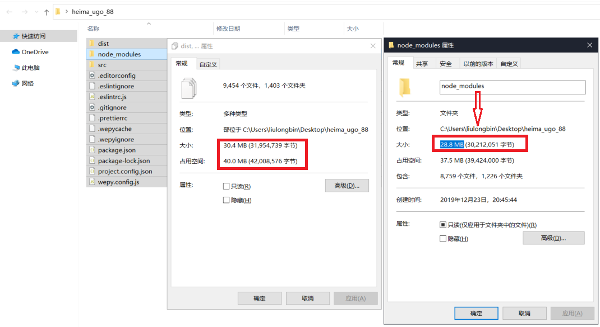

## Node 第 3 天


### 1.  学习目标

◆  能够说出 `pageage.json` 文件中属性的含义

◆  知道怎么解决包下载慢的问题

◆  了解如何开发包

◆  了解如何发布包

◆  熟练模块的加载机制

◆  熟练 express基本操作


### 2. 包管理配置

#### 2.1 包管理配置的概念

`npm` 规定，在项目根目录中，必须提供一个叫做 `package.json` 的包管理配置文件，用来记录与项目有关的一些配置信息，例如：

- 项目的名称、版本号、描述等
- 项目中都用到了哪些包
- 哪些包只会在开发期间会用到
- 哪些包在开发和部署时都需要用到


#### 2.2 理解 `package.json` 配置文件的作用

##### 2.2.1 多人协作的问题

1.  包的体积

   - 整个项目的体积是 `30.4M`
   - 第三方包的体积是 `28.8M`
   - 项目源代码的体积 `1.6M`

   

2.   遇到的问题

   - 第三方包的体积过大，不方便团队成员之间共享项目源代码

   

3.  解决方案

   - 共享时剔除node_modules

   




##### 2.2.2 如何记录项目中安装了哪些包

- 在项目根目录中，创建一个叫做 **`package.json`**的配置文件，即可用来记录项目中安装了哪些包。从而方便剔除 `node_modules` 目录之后，在团队成员之间共享项目的源代码

  

-  今后在项目开发中，一定要把 `node_modules` 文件夹，添加到 `.gitignore` 忽略文件中


#### 2.3 快速创建 `package.json`

`npm` 包管理工具提供了一个快捷命令，可以在执行命令时所处的目录中，快速创建 `package.json` 这个包管理配置文件

```js
npm init
```


注意：

1. 上述命令**只能在英文的目录下成功运行！**所以，项目文件夹的名称**一定要使用英文命名，不要使用中文，不能出现空格**
2.  运行 `npm install` 命令安装包的时候，`npm` 包管理工具会自动把包的名称和版本号，记录到 `package.json` 中


#### 2.4 了解 dependencies 节点的作用

`package.json` 文件中，有一个 `dependencies` 节点，专门用来记录您使用 `npm install` 命令安装了哪些包

```js
// 安装一个包
npm i xxx

// 安装多个包
npm i xxx1  xxx2 
```


#### 2.5 一次性安装所有的包

1.  当我们拿到一个剔除了 node_modules 的项目之后，需要先把所有的包下载到项目中，才能将项目运行起来。否则会报类似于下面的错误：


2.  可以运行 `npm install` 命令（或 `npm i`）一次性安装所有的依赖包

   


#### 2.6 卸载包

1.  可以运行 `npm uninstall` 命令，来卸载指定的包：

2.  注意：`npm uninstall` 命令执行成功后，会把卸载的包，自动从 `package.json` 的 `dependencies` 中移除掉


#### 2.7 了解 `devDependencies` 节点的作用

1.  如果某些包只在项目开发阶段会用到，在项目上线之后不会用到，则建议把这些包记录到 `devDependencies` 节点中

2.  与之对应的，如果某些包在开发和项目上线之后都需要用到，则建议把这些包记录到 `dependencies` 节点中

3.  您可以使用如下的命令，将包记录到 `devDependencies` 节点中

   

   


### 3. 解决包下载慢的问题

#### 3.1 分析包下载慢的原因

在使用 `npm` 下包的时候，默认从国外的 [npm](https://registry.npmjs.org/) 服务器进行下载，此时，网络数据的传输需要经过漫长的海底光缆，因此下包速度会很慢


#### 3.2 了解淘宝 `npm` 镜像服务器的作用

1. 淘宝在国内搭建了一个服务器，专门把国外官方服务器上的包同步到国内的服务器，然后在国内提供下包的服务。从而极大的提高了下包的速度
2.  镜像是一种文件存储形式，一个磁盘上的数据在另一个磁盘上存在一个完全相同的副本即为镜像


#### 3.3 切换 `npm` 的下包镜像源

下包的镜像源，指的就是下包的服务器地址


#### 3.4 使用 `nrm` 切换下载包的服务器

为了更方便的切换下包的镜像源，可以安装 `nrm` 这个小工具，利用 `nrm` 提供的终端命令，可以快速查看和切换下包的镜像源


### 4.  包的分类

#### 4.1 项目包

1.  那些被安装到项目的 `node_modules` 目录中的包，都是项目包

2.  项目包又分为两类，分别是：

   - 开发依赖包，被记录到 `devDependencies` 节点中的包，只在开发期间会用到

   - 核心依赖包，被记录到 `dependencies` 节点中的包，在开发期间和项目上线之后都会用到

     

   


#### 4.2 全局包

1.  在执行 `npm install` 命令时，如果提供了 `-g` 参数，则会把包安装为全局包

2.  全局包会被安装到 `C:\Users\用户目录\AppData\Roaming\npm\node_modules` 目录下

3.  注意：

   - 只有工具性质的包，才有全局安装的必要性。因为它们提供了好用的终端命令

   -  判断某个包是否需要全局安装后才能使用，可以参考官方提供的使用说明即可

     

   


#### 4.3 `i5ting_toc` 的安装和使用

1. `i5ting_toc` 是一个可以把 `md` 文档转为 `html` 页面的小工具

   

   

### 5. 开发属于自己的包

#### 5.1 规范的包结构

1.  一个规范的包，它的组成结构，必须符合以下 3 点要求：

   - 包必须以单独的目录而存在
   - 包的顶级目录下要必须包含 `package.json` 这个包管理配置文件
   - `package.json` 中必须包含 `name`，`version`，`main` 这三个属性，分别代表包的名字、版本号、包的入口

   

2.  注意：以上 3 点要求是一个规范的包结构必须遵守的格式，关于更多的约束，可以参考[这个网址](https://yarnpkg.com/zh-Hans/docs/package-json)

#### 5.2 了解需要实现的功能

1.  需要实现的功能

   - 格式化日期

     

   

   - 转移  `HTML` 中的特殊字符

     

   

   - 还原 `HTML` 中的特殊字符

   


#### 5.3 初始化包的基础结构

1.  新建 `itheima-tools` 文件夹，作为包的根目录

2.  在 `itheima-tools` 文件夹中，新建如下三个文件：

   - `package.json` (包管理配置文件)
   - `index.js` (包的入口文件)
   - `README.md` (包的说明文档)

   

#### 5.4 初始化 `package.json` 配置文件

```json
{
  "name": "flightloong-tools",
  "version": "1.0.0",
  "description": "提供格式化时间、HTMLEscape相关功能",
  "main": "index.js",
  "keywords": [
    "itcast",
    "itheima",
    "dateFormat",
    "escape"
  ],
  "license": "ISC"
}

```


#### 5.5 在 `index.js` 中定义格式化时间的方法

```js
// 包的入口文件 index.js

// 定义格式化时间的函数
function dateFormat (dateStr) {
  const dt = new Date(dateStr)

  const y = padZero(dt.getFullYear())
  const m = padZero(dt.getMonth() + 1)
  const d = padZero(dt.getDate())

  const hh = padZero(dt.getHours())
  const mm = padZero(dt.getMinutes())
  const ss = padZero(dt.getSeconds())

  return `${y}-${m}-${d} ${hh}:${mm}:${ss}`
}

// 定义一个补零的函数
function padZero (n) {
  return n > 9 ? n : '0' + n
}

// 向外暴露需要的成员
module.exports = {
  dateFormat
}

```

```js
// 测试代码

const itheima = require('./flightloong-tools/index')

// 格式化时间的代码
const dtStr = itheima.dateFormat(new Date())
console.log(dtStr) // 2020-06-23 01:16:57

```


#### 5.6 `package.json` 文件中 `main` 的作用

在导入一个文件的时候，如果没有指定一个特定的文件，但是却能够得到某个包的返回内容，这是因为 `Node` 在使用 `require` 导入某个路径的时候，发现没有具体的文件，就会看这个路径下查看是否有 `package.json` 这个文件，如果有，则查看是否有 `main` 这个属性，如果有，则指定 `main` 属性对应的文件作为要执行的文件


#### 5.7 在 `index.js` 中定义转义 HTML 的方法

```js
// index.js
// 定义转义 HTML 字符的函数
function htmlEscape(htmlstr) {
  return htmlstr.replace(/<|>|"|&/g, match => {
    switch (match) {
      case '<':
        return '&glt;'
      case '>':
        return '&gt;'
      case '"':
        return '&quot;'
      case '&':
        return '&amp;'
    }
  })
}
```

```js
// test.js

const itheima = require('./flightloong-tools/index')

// 转义 Html 字符串
const htmlStr = '<h4 title="abc">这是h4标签<span>123&nbsp;</span></h4>'
const str = itheima.htmlEscape(htmlStr)
console.log(str)
```


#### 5.8 在 `index.js` 中定义还原 HTML 的方法

```js
// 定义还原 HTML 字符的函数
function htmlUnEscape(str) {
  return str.replace(/&glt;|&gt;|&quot;|&amp;/g, (match) => {
    switch (match) {
      case '&glt;':
        return '<'
      case '&gt;':
        return '>'
      case '&quot;':
        return '"'
      case '&amp;':
        return '&'
    }
  })
}
```

```js
// 还原 Html 字符串
const resetHtml = itheima.htmlUnEscape(str)
console.log(resetHtml)
```


#### 5.9 划分不同的模块

1.  将格式化时间的功能，拆分到 `src` -> `dateFormat.js` 中
2.  将处理 `HTML` 字符串的功能，拆分到 `src` -> `htmlEscape.js` 中
3.  在 `index.js` 中，导入两个模块，得到需要向外共享的方法
4.  在 `index.js` 中，使用 `module.exports` 把对应的方法共享出去

```js
// dateFormat.js

// 定义格式化时间的函数
function dateFormat(dateStr) {
  const dt = new Date(dateStr)

  const y = padZero(dt.getFullYear())
  const m = padZero(dt.getMonth() + 1)
  const d = padZero(dt.getDate())

  const hh = padZero(dt.getHours())
  const mm = padZero(dt.getMinutes())
  const ss = padZero(dt.getSeconds())

  return `${y}-${m}-${d} ${hh}:${mm}:${ss}`
}

// 定义一个补零的函数
function padZero(n) {
  return n > 9 ? n : '0' + n
}

module.exports = {
  dateFormat
}

```

```js
// htmlEscape.js

// 定义转义 HTML 字符的函数
function htmlEscape(htmlstr) {
  return htmlstr.replace(/<|>|"|&/g, match => {
    switch (match) {
      case '<':
        return '&glt;'
      case '>':
        return '&gt;'
      case '"':
        return '&quot;'
      case '&':
        return '&amp;'
    }
  })
}

// 定义还原 HTML 字符的函数
function htmlUnEscape(str) {
  return str.replace(/&glt;|&gt;|&quot;|&amp;/g, (match) => {
    switch (match) {
      case '&glt;':
        return '<'
      case '&gt;':
        return '>'
      case '&quot;':
        return '"'
      case '&amp;':
        return '&'
    }
  })
}

module.exports = {
  htmlEscape,
  htmlUnEscape
}

```

```js
// test.js

const itheima = require('./flightloong-tools/index')

// 格式化时间的代码
const dtStr = itheima.dateFormat(new Date())
console.log(dtStr)

// 转义 Html 字符串
const htmlStr = '<h4 title="abc">这是h4标签<span>123&nbsp;</span></h4>'
const str = itheima.htmlEscape(htmlStr)
console.log(str)

// 还原 Html 字符串
const resetHtml = itheima.htmlUnEscape(str)
console.log(resetHtml)

```


#### 5.10 编写包的说明文档

1.  包根目录中的 `README.md` 文件，是包的使用说明文档。通过它，我们可以事先把包的使用说明，以 `markdown` 的格式写出来，方便用户参考
2.  `README` 文件中具体写什么内容，没有强制性的要求；只要能够清晰地把包的作用、用法、注意事项等描述清楚即可
3.  我们所创建的这个包的 `README.md `文档中，会包含以下 6 项内容
   - 安装方式
   - 导入方式
   - 格式化时间
   - 转义 HTML 中的特殊字符
   - 还原 HTML 中的特殊字符
   - 开源协议

```markdown
### 安装
​```
npm i flightloong-tools
​```

### 导入
​```js
const itheima = require('./flightloong-tools')
​```

### 格式化时间
​```js
// 调用 dateFormat 对时间进行格式化
const dtStr = itheima.dateFormat(new Date())
// 结果  2020-04-03 17:20:58
console.log(dtStr)
​```

### 转义 HTML 中的特殊字符
​```js
// 带转换的 HTML 字符串
const htmlStr = '<h1 title="abc">这是h1标签<span>123&nbsp;</span></h1>'
// 调用 htmlEscape 方法进行转换
const str = itheima.htmlEscape(htmlStr)
// 转换的结果 &lt;h1 title=&quot;abc&quot;&gt;这是h1标签&lt;span&gt;123&amp;nbsp;&lt;/span&gt;&lt;/h1&gt;
console.log(str)
​```

### 还原 HTML 中的特殊字符
​```js
// 待还原的 HTML 字符串
const str2 = itheima.htmlUnEscape(str)
// 输出的结果 <h1 title="abc">这是h1标签<span>123&nbsp;</span></h1>
console.log(str2)
​```

### 开源协议
ISC
```


#### 5.11 注册 `npm` 账号

1.  访问 [npm](https://www.npmjs.com/ ) 网站，点击 `sign up` 按钮，进入注册用户界面
2.  填写账号相关的信息：`Full Name`、`Public Email`、`Username`、`Password`
3.  点击 `Create an Account` 按钮，注册账号
4.  登录邮箱，点击验证链接，进行账号的验证


#### 5.12 登录 `npm` 账号

1.  `npm` 账号注册完成后，可以在终端中执行 `npm login` 命令，依次输入用户名、密码、邮箱后，即可登录成功
2.  **注意：在运行 `npm login` 命令之前，必须先把下包的服务器地址切换为 `npm` 的官方服务器。否则会导致发布包失败！**


#### 5.13 把包发布到 `npm`上

将终端切换到包的根目录之后，运行 `npm publish` 命令，即可将包发布到 `npm` 上（注意：包名不能雷同）


#### 5.14 - 删除已发布的包

1.  运行 `npm unpublish 包名 --force` 命令，即可从 `npm` 删除已发布的包

   

2.  注意事项

   - `npm unpublish` 命令**只能删除 72 小时以内发布的包**
   - `npm unpublish` 删除的包，**在 24 小时内不允许重复发布**
   -  发布包的时候要慎重，尽量**不要往 `npm` 上发布没有意义的包！**


### 6. 模块的加载机制

#### 6.1 优先从缓存中加载

模块在第一次加载后会被缓存，这意味着多次调用 `require()` 方法不会导致模块的代码被多次执行

注意：不论内置模块、用户自定义模块、还是第三方模块，他们都会优先从缓存中加载，从而提高模块的加载效率

```js
// 自定义模块.js

console.log('ok')
```

```js
require('./自定义模块.js')
require('./自定义模块.js')
require('./自定义模块.js')
```


#### 6.2 内置模块的加载优先级

内置模块是由 `Node.js` 官方提供的模块，**内置模块的加载优先级最高**

例如： `require('fs')` 始终返回内置的 `fs` 模块，即使在 `node_modules` 目录下有名字相同的包也叫做 `fs`

```js
const fs = require('fs') // 始终返回的是内置的 fs 模块
```


#### 6.3 自定义模块的加载机制

1.  使用 require() 加载自定义模块时，必须指定以 `./` 或者 `../` 开头的路径标识符。在加载自定义模块时，如果没有指定 `./` 或 `../` 这样的路径标识符，则 `node` 会把它当作 `内置模块` 或 `第三方模块` 进行加载
   
2.   在使用 `require()` 导入自定义模块时，如果省略了文件的拓展名，则 `Node` 会按照顺序分别尝试加载以下文件
   - 按照 **确切的文件名** 进行加载
   -  补全 **`.js`  **扩展名进行加载
   - 补全 **`.json` ** 扩展名进行加载
   - 补全 **`.node`** 扩展名进行加载
   - 加载失败，终端报错


#### 6.4 第三方模块的加载机制

1. 如果传递给 `require()` 的模块标识符不是一个内置模块，也没有以 `'./'` 或  `'../'` 开头，则 `Node.js` 会从当前模块的父目录开始，尝试从 `/node_modules` 文件夹中加载第三方模块

   

2.  **如果没有找到对应的第三方模块，则移动到再上一层父目录中，进行加载，直到文件系统的根目录**

   

3.  假设在 `C:\Users\itheima\project\foo.js` 文件里调用了 `require('tools')`，则 `Node.js` 会按以下顺序查找

   - `C:\Users\itheima\project\node_modules\tools`
   - `C:\Users\itheima\node_modules\tools`
   - `C:\Users\node_modules\tools`
   - `C:\node_modules\tools`


#### 6.5 目录作为模块

当把目录作为模块标识符，传递给 `require()` 进行加载的时候，有三种加载方式：

1.  在被加载的目录下查找一个叫做 `package.json` 的文件，并寻找 `main` 属性，作为 `require()` 加载的入口
2.  如果目录里没有 `package.json` 文件，或者 `main` 入口不存在或无法解析，则 `Node.js` 将会试图加载目录下的 `index.js` 文件
3. 如果以上两步都失败了，则 `Node.js` 会在终端打印错误消息，报告模块的缺失：`Error: Cannot find module xxx`


### 7. 初始 express

#### 7.1 express 简介

##### 7.1.1 什么是 express

1.  官方给出的概念：`Express` 是基于 `Node.js` 平台，快速、开放、极简的 `Web` 开发框架，[官方]( http://www.expressjs.com.cn/)
2.  通俗的理解：`Express` 的作用和 `Node.js` 内置的 `http` 模块类似，是专门用来创建 Web 服务器的
3.  `Express` 的本质：就是一个 `npm` 上的第三方包，提供了快速创建 Web 服务器的便捷方法


##### 7.1.2 进一步理解 Express

1.  思考：不使用 Express 能否创建 Web 服务器？

   - 答案：能，使用 `Node.js` 提供的原生 `http` 模块即可

   

2.  思考：既生瑜何生亮（有了 `http` 内置模块，为什么还有用 `Express`）？

   - 答案：`http` 内置模块用起来很复杂，开发效率低；`Express` 是基于内置的 `http` 模块进一步封装出来的，能够- 极大的提高开发效率

   

3.  思考：`http` 内置模块与 `Express` 是什么关系？

   - 答案：类似于浏览器中 `Web API` 和 `jQuery` 的关系。后者是基于前者进一步封装出来的


##### 7.1.3 Express 能做什么

1.  对于前端程序员来说，最常见的两种服务器，分别是：

   - **`Web` 网站服务器**：专门对外提供 `Web` 网页资源的服务器。

   -  **`API` 接口服务器**：专门对外提供 `API ` 接口的服务器。

     

2. 使用 `Express`，我们可以方便、快速的创建 `Web` 网站的服务器或 `API` 接口的服务器。


#### 7.2  Express 的基本使用

1.  安装

   在项目所处的目录中，运行如下的终端命令，即可将 express 安装到项目中使用

   ```js
   npm i express
   ```

   

2. 创建基本的 Web 服务器

   ```js
   // 1.导入 express
   const express = require('express')
   // 2. 创建 web 服务器
   const app = express()
   
   // 3. 调用 app.listen(端口号, 启动后的回调函数), 启动服务器
   app.listen(3000, () => {
     console.log('running……')
   })
   
   ```

   

#### 7.3 监听 GET 和 POST 请求，并影响客户端

1. 监听 `GET` 请求

   - 通过 `app.get()` 方法，可以监听客户端的 GET 请求，具体的语法格式如下

     

   
   
2. 监听 `POST` 请求

   - 通过 `app.post()` 方法，可以监听客户端的 POST 请求，具体的语法格式如下

     


3.  把内容响应给客户端

   - 通过 `res.send()` 方法，可以把处理好的内容，发送给客户端

     


4.  完整代码

   ```js
   // 1.导入 express
   const express = require('express')
   // 2. 创建 web 服务器
   const app = express()
   
   // 4. 监听客户端的 GET 和 Post 请求，并向客户端响应具体的内容
   app.get('/user', (req, res) => {
     // 调用 express 提供的 res.send() 方法，向客户端响应一个 JSON 对象
     res.send({ name: 'zs', age: 20, gender: '男' })
   })
   
   app.post('/user', (req, res) => {
     // 调用 express 提供的 res.send() 方法，向客户端响应一个文本字符串
     res.send('请求成功')
   })
   
   // 3. 调用 app.listen(端口号, 启动后的回调函数), 启动服务器
   app.listen(3000, () => {
     console.log('running……')
   })
   
   ```

   

#### 7.4 获取 URL 中携带的查询参数

1.  通过 `req.query` 对象，可以访问到客户端通过查询字符串的形式，发送到服务器的参数

   


2.  完整代码

   ```js
   
   const express = require('express')
   const app = express()
   
   app.get('/', (req, res) => {
     // 通过 req.query 可以获取到客户端发送过来的，查询参数
     // 注意：默认情况下， req.query 是一个空对象
     console.log(req.query)
     res.send(req.query)
   })
   
   app.listen(3000, () => {
     console.log('running……')
   })
   
   ```

   


#### 7.5 获取 URL 中的动态参数

1.  通过 `req.params` 对象，可以访问到 `URL` 中，通过 : 匹配到的动态参数

   


2.  补充知识点

   - `/:id​` -- id 值不是固定的，可以自己定义，例如： `/:ids`
   - 展示到页面中的 `id` 键，是自定义的变量值
   - 参数可以有多个，例如： `/:ids/:name`

   
   
3. 完整代码

```js
const express = require('express')
const app = express()

// 注意：这里的 :id 是一个动态的参数
app.get('/user/:id', (req, res) => {
  // req.params 是动态匹配到的 URL 参数，默认也会是一个空对象
  console.log(req.params)
  res.send(req.params)
})

app.listen(3000, () => {
  console.log('running……')
})

```


#### 7.6 托管静态资源

##### 7.6.1 `express.static()`

1.  `express` 提供了一个非常好用的函数，叫做 `express.static()`，通过它，我们可以非常方便地创建一个静态资源服务器，
   例如，通过如下代码就可以将 `public` 目录下的图片、`CSS` 文件、`JavaScript` 文件对外开放访问了

   

   现在，你就可以访问 public 目录中的所有文件了：
   访问图片资源：http://localhost:3000/images/bg.jpg
   访问 `css` 资源：http://localhost:3000/css/style.css
   访问 `js` 资源：http://localhost:3000/js/login.js

2.  注意：`Express` 在指定的静态目录中查找文件，并对外提供资源的访问路径。因此，存放静态文件的目录名不会出现在 `URL` 中


3.  完整代码

   ```js
   const express = require('express')
   const app = express()
   
   // 在这里，调用 express.static() 方法，快速的对外提供静态资源
   app.use(express.static('public'))
   
   app.listen(3000, () => {
     console.log('running……')
   })
   
   ```

   

##### 7.6.2 托管多个静态资源目录

1.  如果要托管多个静态资源目录，请多次调用 `express.static()` 函数，
    访问静态资源文件时，`express.static()` 函数会根据目录的添加顺序查找所需的文件

   

2. 完整代码

   ```js
   const express = require('express')
   const app = express()
   
   // 在这里，调用 express.static() 方法，快速的对外提供静态资源
   app.use(express.static('public'))
   app.use(express.static('static'))
   
   app.listen(3000, () => {
     console.log('running……')
   })
   
   ```


##### 7.6.3   挂载路径前缀

1.  如果希望在托管的静态资源访问路径之前，挂载路径前缀，则可以使用如下的方式

   

   可以通过带有 `/public` 前缀地址来访问 public 目录中的文件了：
   http://localhost:3000/public/images/kitten.jpg
   http://localhost:3000/public/css/style.css
   http://localhost:3000/public/js/app.js

   
   
2.  完整代码

   ```js
   const express = require('express')
   const app = express()
   
   // 在这里，调用 express.static() 方法，快速的对外提供静态资源
   app.use('/static', express.static('public'))
   
   app.listen(3000, () => {
     console.log('running……')
   })
   
   ```

   


#### 8.  安装 `nodemon`

#### 8.1 安装 `nodemon`

1.  为什么要使用 `nodemon`

   在编写调试 `Node.js` 项目的时候，如果修改了项目的代码，则需要频繁的手动 `close` 掉，然后再重新启动，非常繁琐。现在，我们可以使用 [nodemon](https://www.npmjs.com/package/nodemon) 这个工具，它能够监听项目文件的变动，当代码被修改后，`nodemon` 会自动帮我们重启项目，极大方便了开发和调试

   

2. 安装 `nodemon`

   ```js
   npm i nodemon -g
   ```

   

#### 8.2 使用 `nodemon` 实现后台项目的重启

1.  当基于 `Node.js` 编写了一个网站应用的时候，传统的方式，是运行 `node app.js` 命令，来启动项目
   这样做的坏处是：代码被修改之后，需要手动重启项目

   

2. 将 `node` 命令替换为 `nodemon` 命令，使用 `nodemon app.js` 来启动项目

   这样做的好处是：代码被修改之后，会被 `nodemon` 监听到，从而实现自动重启项目的效果

   ```js
   // 使用 node 运行项目
   node app.js
   
   // 使用 nodemon 运行项目
   nodemon index.js
   ```

   


