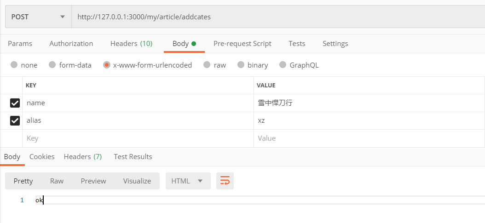
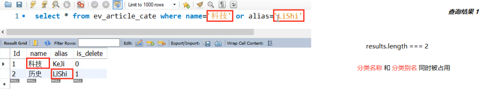
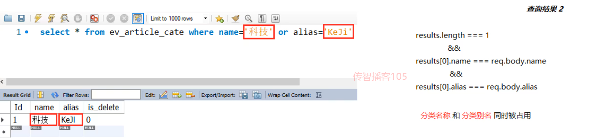
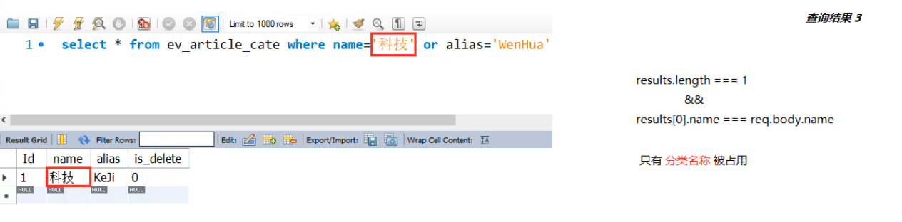
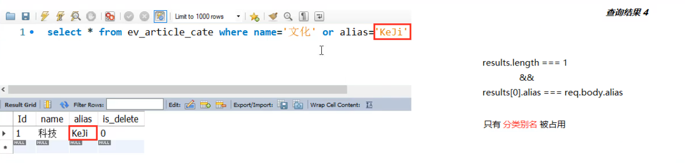

## Node 第 8 天

### 1.  学习目标

◆ 完成获取文章分类列表的功能

◆ 完成新增文章分类的功能

◆ 完成根据 ID 删除文章分类的功能

◆ 完成根据 ID 获取文章分类的功能

◆ 完成根据 ID 更新文章分类的功能

◆ 完成发布新文章的功能


### 2. 新建 `ev_article_cate` 数据表

#### 2.1 创建表结构


#### 2.2 新增两条初始化的数据


### 3. 获取文章分类列表

#### 3.1 实现步骤

1.  初始化路由模块
2.  初始化路由处理函数模块
3.  获取文章分类列表数据


#### 3.2 初始化路由模块

1.  创建  `/router/artcate.js` 路由模块，并初始化如下的代码结构

   ```js
   // // 导入 express
   const express = require('express')
   
   // 创建路由对象
   const router = express.Router()
   
   // 获取文章分类的列表数据
   router.get('/cates', (req, res) => {
     res.send('ok')
   })
   
   // 向外共享路由对象
   module.exports = router
   
   ```

   

2.  在 `app.js` 中导入并使用文章分类的路由模块

   ```js
   // 导入并使用文章分类路由模块
   const artCateRouter = require('./router/userinfo')
   
   // 为文章分类的路由挂载统一的访问前缀 /my/article
   app.use('/my/article', artCateRouter)
   ```

   

#### 3.3 初始化路由处理函数模块

1.  创建 `/router_handler/artcate.js` 路由处理函数模块，并初始化如下的代码结构

   ```js
   // 获取文章分类列表数据的处理函数
   exports.getArticleCates = (req, res) => {
     res.send('ok')
   }
   
   ```

   

2.  修改 `/router/artcate.js` 中的代码

   ```js
   // // 导入 express
   const express = require('express')
   
   // 创建路由对象
   const router = express.Router()
   // 导入文章分类的路由处理函数模块
   const artcate_handler = require('../router_handler/artcate')
   
   // 获取文章分类的列表数据
   router.get('/cates', artcate_handler.getArticleCates)
   
   // 向外共享路由对象
   module.exports = router
   
   ```

   

#### 3.4 实现获取文章分类列表数据的功能

1.  在 `/router_handler/artcate.js` 头部导入数据库操作模块

   ```js
   // 导入数据库操作模块
   const db = require('../db/index')
   ```

   

2.  定义 `SQL` 语句

   ```js
   // 定义查询分类列表数据的 SQL 语句
   // is_delete 为 0 表示没有被 标记为删除 的数据
   const sql = 'select * from ev_article_cate where is_delete=0 order by id asc'
   ```

   

3.  调用 `db.query()` 执行 `SQL` 语句

   ```js
   // 调用 db.query() 执行 SQL 语句
   db.query(sql, (err, results) => {
     // SQL 语句执行失败
     if (err) return res.cc(err)
   
     // SQL 语句执行成功
     res.send({
       status: 0,
       message: '获取文章分类列表成功！',
       data: results,
     })
   })
   ```

   

4.  完整代码

   ```js
   // 这是路由处理函数模块
   
   // 导入数据库操作模块
   const db = require('../db/index')
   
   // 获取文章分类列表数据的处理函数
   exports.getArticleCates = (req, res) => {
     // 定义查询分类列表数据的 SQL 语句
     // is_delete 为 0 表示没有被 标记为删除 的数据
     const sql = 'select * from ev_article_cate where is_delete=0 order by id asc'
   
     // 调用 db.query() 执行 SQL 语句
     db.query(sql, (err, results) => {
       // SQL 语句执行失败
       if (err) return res.cc(err)
   
       // SQL 语句执行成功
       res.send({
         status: 0,
         message: '获取文章分类列表成功！',
         data: results,
       })
     })
   }
   
   ```

   

5.  测试

   


### 4. 新增文章分类

#### 4.1 实现步骤

1.  定义路由和处理函数
2.  验证表单数据
3.  查询 `分类名称` 与 `分类别名` 是否被占用
4.  实现新增文章分类的功能


#### 4.2 定义路由和处理函数

1. 在 `/router/artcate.js` 模块中，添加 `新增文章分类` 的路由

   ```js
   // 新增文章分类的路由
   router.post('/addcates', artcate_handler.addArticleCates)
   ```

   

2.  在 `/router_handler/artcate.js` 模块中，定义并向外共享 `新增文章分类` 的路由处理函数

   ```js
   // 新增文章分类的处理函数
   exports.addArticleCates = (req, res) => {
     res.send('ok')
   }
   
   ```

   

#### 4.3 验证表单数据

1.  创建 `/schema/artcate.js` 文章分类数据验证模块

   ```js
   // 1. 导入定义验证规则的模块
   const joi = require('@hapi/joi')
   
   // 2/ 定义 name 和 alias 的校验规则
   const name = joi.string().required()
   const alias = joi.string().alphanum().required()
   
   // 向外共享验证规则对象
   exports.add_cate_schema = {
     body: {
       name,
       alias
     }
   }
   
   ```

   

2.  在 `/router/artcate.js` 模块中，使用 `add_cate_schema` 对数据进行验证

   ```js
   // 导入验证数据的中间件
   const expressJoi = require('@escook/express-joi')
   
   // 导入文章分类的验证模块
   const { add_cate_schema } = require('../schema/artcate')
   
   // 新增文章分类的路由
   router.post('/addcates', expressJoi(add_cate_schema), artcate_handler.addArticleCates)
   
   ```

   

3.  验证

   


#### 4.4 分析分类名和别名被占用的四种情况

1.  分类名称和分类别名同时被占用

   

   
   
2.  分类名称和分类别名同时被占用

   

   
   
3.  只有分类名称被占用

   

   
   
4.   只有分类别名被占用

   


#### 4.5 写代码判断分类名称和别名是否被占用

1.  定义查重的 `SQL` 语句

   ```js
   // 定义查询 分类名称 与 分类别名 是否被占用的 SQL 语句
   const sql = `select * from ev_article_cate where name=? or alias=?`
   ```

   

2. 调用 `db.query()` 执行查重的操作

   ```js
   // 执行查重操作
   db.query(sql, [req.body.name, req.body.alias], (err, results) => {
     // 执行 SQL 语句失败
     if (err) return res.cc(err)
   
     // 分类名称 和 分类别名 都被占用
     if (results.length === 2) return res.cc('分类名称与别名被占用，请更换后重试！')
     if (results.length === 1 && results[0].name === req.body.name && results[0].alias === req.body.alias) return res.cc('分类名称与别名被占用，请更换后重试！')
     // 分类名称 或 分类别名 被占用
     if (results.length === 1 && results[0].name === req.body.name) return res.cc('分类名称被占用，请更换后重试！')
     if (results.length === 1 && results[0].alias === req.body.alias) return res.cc('分类别名被占用，请更换后重试！')
   
     // TODO：新增文章分类
   })
   ```


3.  完整代码

   ```js
   // 新增文章分类的处理函数
   exports.addArticleCates = (req, res) => {
     // 1. 定义查重的 sql 语句
     const sql = `select * from ev_article_cate where name=? or alias=?`
   
     // 2. 执行查重的 sql 语句
     db.query(sql, [req.body.name, req.body.alias], (err, results) => {
       // 3. SQL 语句执行失败
       if (err) return res.cc(err)
   
       // 4.1 判断数据的 length
       if (results.length === 2) return res.cc('分类名称与别名被占用，请更换后重试！')
       // 4.2 length 等于 1 的三种情况，分类名称 或 分类别名 被占用
       if (results.length === 1 && results[0].name === req.body.name && results[0].alias === req.body.alias) return res.cc('分类名称与别名被占用，请更换后重试！')
       if (results.length === 1 && results[0].name === req.body.name) return res.cc('分类名称被占用，请更换后重试！')
       if (results.length === 1 && results[0].alias === req.body.alias) return res.cc('分类别名被占用，请更换后重试！')
   
       res.send('Ok')
     })
   }
   
   ```

   

#### 4.6 实现新增文章分类的功能

1.  定义新增文章分类的 `SQL` 语句

   ```js
   // 定义插入文章分类的 sql 语句
   const sql = `insert into ev_article_cate set ?`
   ```

   

2.  调用 `db.query()` 执行新增文章分类的 `SQL` 语句

   ```js
   // 执行插入文章分类的 sql 语句
   db.query(sql, req.body, (err, results) => {
     // SQL 语句执行失败
     if (err) return res.cc(err)
   
     // SQL 语句执行成功，但是影响行数不等于 1
     if (results.affectedRows !== 1) return res.cc('新增文章分类失败！')
   
     // 新增文章分类成功
     res.cc('新增文章分类成功！', 0)
   })
   ```

   

3.  完整代码

   ```js
   // 新增文章分类的处理函数
   exports.addArticleCates = (req, res) => {
     // 1. 定义查重的 sql 语句
     const sql = `select * from ev_article_cate where name=? or alias=?`
   
     // 2. 执行查重的 sql 语句
     db.query(sql, [req.body.name, req.body.alias], (err, results) => {
       // 3. SQL 语句执行失败
       if (err) return res.cc(err)
   
       // 4.1 判断数据的 length
       if (results.length === 2) return res.cc('分类名称与别名被占用，请更换后重试！')
       // 4.2 length 等于 1 的三种情况，分类名称 或 分类别名 被占用
       if (results.length === 1 && results[0].name === req.body.name && results[0].alias === req.body.alias) return res.cc('分类名称与别名被占用，请更换后重试！')
       if (results.length === 1 && results[0].name === req.body.name) return res.cc('分类名称被占用，请更换后重试！')
       if (results.length === 1 && results[0].alias === req.body.alias) return res.cc('分类别名被占用，请更换后重试！')
   
       // 定义插入文章分类的 sql 语句
       const sql = `insert into ev_article_cate set ?`
   
       // 执行插入文章分类的 sql 语句
       db.query(sql, req.body, (err, results) => {
         // SQL 语句执行失败
         if (err) return res.cc(err)
   
         // SQL 语句执行成功，但是影响行数不等于 1
         if (results.affectedRows !== 1) return res.cc('新增文章分类失败！')
   
         // 新增文章分类成功
         res.cc('新增文章分类成功！', 0)
       })
     })
   }
   
   ```

   

4.  测试

   


### 5. 根据 id 删除文章分类

#### 5.1 实现步骤

1.  定义路由和处理函数
2.  验证表单数据
3.  实现删除文章分类的功能


#### 5.2 定义路由和处理函数

1.  在 `/router/artcate.js` 模块中，添加 `删除文章分类` 的路由

   ```js
   // 删除文章分类的路由
   router.get('/deletecate/:id', artcate_handler.deleteCateById)
   ```

   

2.  在 `/router_handler/artcate.js` 模块中，定义并向外共享 `删除文章分类` 的路由处理函数

   ```js
   // 删除文章分类的处理函数
   exports.deleteCateById = (req, res) => {
     res.send('ok')
   }
   ```

   

3.  验证

   


#### 5.3 验证客户端提交到服务器的 id 值

1.  在 `/schema/artcate.js` 验证规则模块中，定义 id 的验证规则

   ```js
   // 定义 分类 Id 的校验规则
   const id = joi.number().integer().min(1).required()
   
   ```

   

2.  并使用 `exports` 向外共享如下的 `验证规则对象`

   ```js
   // 向外共享删除分类的规则对象
   exports.delete_cate_schema = {
     params: {
       id
     }
   }
   ```

   

3. 在 `/router/artcate.js` 模块中，导入需要的验证规则对象，并在路由中使用

   ```js
   // 导入删除分类的验证规则对象
   const { delete_cate_schema } = require('../schema/artcate')
   
   // 删除文章分类的路由
   router.get('/deletecate/:id', expressJoi(delete_cate_schema), artcate_handler.deleteCateById)
   ```

   

4.  验证

   


#### 5.4 实现删除文章分类的功能

1.  定义删除文章分类的 `SQL` 语句

   ```js
   // 1. 定义删除的 sql 语句
   const sql = `update ev_article_cate set is_delete=1 where id=?`
   
   ```

   

2.  调用 `db.query()` 执行删除文章分类的 `SQL` 语句

   ```js
   // 2. 执行查重的 sql 语句
   db.query(sql, req.params.id, (err, results) => {
     // SQL 语句执行失败
     if (err) return res.cc(err)
   
     // 语句执行 SQL 成功，但是影响行数不等于 1
     if (results.affectedRows !== 1) return res.cc('删除文章分类失败！')
   
     // 删除文章分类成功
     res.cc('删除文章分类成功！', 0)
   })
   ```

   

3.  完整代码

   ```js
   // 删除文章分类的处理函数
   exports.deleteCateById = (req, res) => {
     // 1. 定义删除的 sql 语句
     const sql = `update ev_article_cate set is_delete=1 where id=?`
   
     // 2. 执行删除的 sql 语句
     db.query(sql, req.params.id, (err, results) => {
       // SQL 语句执行失败
       if (err) return res.cc(err)
     
       // 语句执行 SQL 成功，但是影响行数不等于 1
       if (results.affectedRows !== 1) return res.cc('删除文章分类失败！')
     
       // 删除文章分类成功
       res.cc('删除文章分类成功！', 0)
     })
   }
   ```

   

4.  验证

   


### 6. 根据 id 获取文章分类

#### 6.1 实现步骤

1.  定义路由和处理函数
2.  验证表单数据
3.  实现获取文章分类的功能


#### 6.2 定义路由和处理函数

1.  在 `/router/artcate.js` 模块中，添加 `根据 Id 获取文章分类` 的路由

   ```js
   // 查询文章分类的路由
   router.get('/cates/:id', artcate_handler.getArticleById)
   ```

   

2.  在 `/router_handler/artcate.js` 模块中，定义并向外共享 `根据 Id 获取文章分类` 的路由处理函数

   ```js
   // 根据 Id 获取文章分类的处理函数
   exports.getArticleById = (req, res) => {
     res.send('ok')
   }
   ```

   

3.  验证

   


#### 6.3 验证客户端提交到服务器的 id 值

1.  在 `/schema/artcate.js` 验证规则模块中，使用 `exports` 向外共享如下的 `验证规则对象`

   ```js
   // 向外共享根据 Id 获取分类的规则对象
   exports.get_cate_schema = {
     params: {
       id
     }
   }
   
   ```

   

2.  在 `/router/artcate.js` 模块中，导入需要的验证规则对象，并在路由中使用

   ```js
   // 导入根据 Id 获取分类的验证规则对象
   const { get_cate_schema } = require('../schema/artcate')
   
   //  根据 Id 获取文章分类的路由
   router.get('/cates/:id', expressJoi(get_cate_schema), artcate_handler.getArticleById)
   ```

   

3.  验证

   


#### 6.4 实现获取文章分类的功能

1.  定义根据 Id 获取文章分类的 `SQL` 语句

   ```js
   // 1. 定义根据 id 获取文章分类的 sql 语句
   const sql = `select * from ev_article_cate where id=?`
   
   
   ```

   

2.  调用 `db.query()` 执行 `SQL` 语句

   ```js
   // 2. 执行查询的 sql 语句
   db.query(sql, req.params.id, (err, results) => {
     // 执行 SQL 语句失败
     if (err) return res.cc(err)
   
     // SQL 语句执行成功，但是没有查询到任何数据
     if (results.length !== 1) return res.cc('获取文章分类数据失败！')
   
     // 把数据响应给客户端
     res.send({
       status: 0,
       message: '获取文章分类数据成功！',
       data: results[0],
     })
   })
   ```

   

3.   完整代码

   ```js
   // 根据 Id 获取文章分类的处理函数
   exports.getArticleById = (req, res) => {
     // 1. 定义根据 id 获取文章分类的 sql 语句
     const sql = `select * from ev_article_cate where id=?`
   
     // 2. 执行查询的 sql 语句
     db.query(sql, req.params.id, (err, results) => {
       // 执行 SQL 语句失败
       if (err) return res.cc(err)
     
       // SQL 语句执行成功，但是没有查询到任何数据
       if (results.length !== 1) return res.cc('获取文章分类数据失败！')
     
       // 把数据响应给客户端
       res.send({
         status: 0,
         message: '获取文章分类数据成功！',
         data: results[0],
       })
     })
   }
   ```

   

4.  验证

   


### 7. 根据 id 更新文章分类

#### 7.1 实现步骤

1.  定义路由和处理函数
2.  验证表单数据
3.  查询 `分类名称` 与 `分类别名` 是否被占用
4.  实现更新文章分类的功能


#### 7.2 定义路由和处理函数

1.  在 `/router/artcate.js` 模块中，添加 `更新文章分类` 的路由

   ```js
   // 更新文章分类的路由
   router.post('/updatecate', artcate_handler.updateCateById)
   ```

   

2.  在 `/router_handler/artcate.js` 模块中，定义并向外共享 `更新文章分类` 的路由处理函数

   ```js
   // 更新文章分类的处理函数
   exports.updateCateById = (req, res) => {
     res.send('ok')
   }
   
   ```

   

3.  验证

   


#### 7.3 验证表单数据

1.  在 `/schema/artcate.js` 验证规则模块中，使用 `exports` 向外共享如下的 `验证规则对象`

   ```js
   // 向外共享更新分类的规则对象
   exports.update_cate_schema = {
     body: {
       Id: id,
       name,
       alias
     }
   }
   
   ```

   

2.  在 `/router/artcate.js` 模块中，导入需要的验证规则对象，并在路由中使用

   ```js
   // 导入更新文章分类的验证规则对象
   const { update_cate_schema } = require('../schema/artcate')
   
   // 更新文章分类的路由
   router.post('/updatecate', expressJoi(update_cate_schema), artcate_handler.updateCateById)
   ```

   

3.  验证

   


#### 7.4 查询分类名称与别名是否被占用

1.  定义查重的 `SQL` 语句

   ```js
   // 1. 定义查询 分类名称 与 分类别名 是否被占用的 SQL 语句
   const sql = `select * from ev_article_cate where Id<>? and (name=? or alias=?)`
   
   ```

   

2.  调用 `db.query()` 执行查重的操作

   ```js
   // 2. 执行查重的 sql 语句
   db.query(sql, [req.body.Id, req.body.name, req.body.alias], (err, results) => {
     // 执行 SQL 语句失败
     if (err) return res.cc(err)
   
     // 分类名称 和 分类别名 都被占用
     if (results.length === 2) return res.cc('分类名称与别名被占用，请更换后重试！')
     if (results.length === 1 && results[0].name === req.body.name && results[0].alias === req.body.alias) return res.cc('分类名称与别名被占用，请更换后重试！')
     // 分类名称 或 分类别名 被占用
     if (results.length === 1 && results[0].name === req.body.name) return res.cc('分类名称被占用，请更换后重试！')
     if (results.length === 1 && results[0].alias === req.body.alias) return res.cc('分类别名被占用，请更换后重试！')
   
     res.send('ok')
   })
   ```

   

3.  验证

   


#### 7.5 实现更新文章分类的功能

1.  定义更新文章分类的 `SQL` 语句

   ```js
   // 更新分类的 sql 语句
   const sql = `update ev_article_cate set ? where Id=?`
   
   ```

   

2.  调用 `db.query()` 执行 `SQL` 语句

   ```js
   // 执行 sql 语句
   db.query(sql, [req.body, req.body.Id], (err, results) => {
     // SQL 语句执行失败
     if (err) return res.cc(err)
   
     // SQL 语句执行成功，但是影响行数不等于 1
     if (results.affectedRows !== 1) return res.cc('更新文章分类失败！')
   
     // 更新文章分类成功
     res.cc('更新文章分类成功！', 0)
   })
   ```

   

3.  完整代码

   ```js
   // 更新文章分类的处理函数
   exports.updateCateById = (req, res) => {
     // 1. 定义查询 分类名称 与 分类别名 是否被占用的 SQL 语句
     const sql = `select * from ev_article_cate where Id<>? and (name=? or alias=?)`
   
     // 2. 执行查重的 sql 语句
     db.query(sql, [req.body.Id, req.body.name, req.body.alias], (err, results) => {
       // 执行 SQL 语句失败
       if (err) return res.cc(err)
   
       // 分类名称 和 分类别名 都被占用
       if (results.length === 2) return res.cc('分类名称与别名被占用，请更换后重试！')
       if (results.length === 1 && results[0].name === req.body.name && results[0].alias === req.body.alias) return res.cc('分类名称与别名被占用，请更换后重试！')
       // 分类名称 或 分类别名 被占用
       if (results.length === 1 && results[0].name === req.body.name) return res.cc('分类名称被占用，请更换后重试！')
       if (results.length === 1 && results[0].alias === req.body.alias) return res.cc('分类别名被占用，请更换后重试！')
   
   
       // 更新分类的 sql 语句
       const sql = `update ev_article_cate set ? where Id=?`
   
       // 执行 sql 语句
       db.query(sql, [req.body, req.body.Id], (err, results) => {
         // SQL 语句执行失败
         if (err) return res.cc(err)
   
         // SQL 语句执行成功，但是影响行数不等于 1
         if (results.affectedRows !== 1) return res.cc('更新文章分类失败！')
   
         // 更新文章分类成功
         res.cc('更新文章分类成功！', 0)
       })
     })
   }
   
   ```

   

4.  验证

   


### 8. 发布新文章

#### 8.1 新建 `ev_articles` 表


#### 8.2 实现步骤

1.  初始化路由模块
2.  初始化路由处理函数模块
3.  使用 `multer` 解析表单数据
4.  验证表单数据
5.  实现发布文章的功能


#### 8.3 初始化路由模块

1.  创建 `/router/article.js` 路由模块，并初始化如下的代码结构

   ```js
   // 导入 express
   const express = require('express')
   // 创建路由对象
   const router = express.Router()
   
   // 发布新文章
   router.post('/add', (req, res) => {
     res.send('ok')
   })
   
   // 向外共享路由对象
   module.exports = router
   
   ```

   

2.  在 `app.js` 中导入并使用文章的路由模块

   ```js
   // 导入并使用文章路由模块
   const articleRouter = require('./router/article')
   
   // 为文章的路由挂载统一的访问前缀 /my/article
   app.use('/my/article', articleRouter)
   ```


#### 8.4 初始化路由处理函数模块

1.  创建 `/router_handler/article.js` 路由处理函数模块，并初始化代码结构

   ```js
   // 发布新文章的处理函数
   exports.addArticle = (req, res) => {
     res.send('ok')
   }
   
   ```

   

2. 修改 `/router/article.js` 中的代码

   ```js
   // 导入文章的路由处理函数模块
   const article_handler = require('../router_handler/article')
   
   // 发布新文章
   router.post('/add', article_handler.addArticle)
   ```

   

3.  完整代码

   ```js
   // 导入 express
   const express = require('express')
   // 创建路由对象
   const router = express.Router()
   
   // 导入文章的路由处理函数模块
   const article_handler = require('../router_handler/article')
   
   // 发布新文章
   router.post('/add', article_handler.addArticle)
   
   // 向外共享路由对象
   module.exports = router
   
   ```

   

4. 验证

   


#### 8.5 了解 `multer` 的作用

1.  使用 `express.urlencoded()` 中间件无法解析 `multipart/form-data` 格式的请求体数据，也就是说无法接收到 `fomData` 表单传递过来的数据
2.   推荐使用 `multer` 来解析 `multipart/form-data` 格式的表单数据


#### 8.6 安装和配置 `multer`

1. 运行如下的终端命令，在项目中安装 `multer`

   ```js
   cnpm i multer@1.4.2 -S
   ```

   

2.  在 `/router/article.js` 模块中导入并配置 `multer`

   ```js
   // 导入解析 formdata 格式表单数据的包
   const multer = require('multer')
   // 导入处理路径的核心模块
   const path = require('path')
   
   // 创建 multer 的实例对象，通过 dest 属性指定文件的存放路径
   const upload = multer({ dest: path.join(__dirname, '../uploads') })
   ```


#### 8.7 使用 `multer`解析  `FormData`  格式的表单数据

1.  修改 `发布新文章` 的路由

   - 使用 `upload.single()` 方法，它是一个局部生效的中间件，用来解析 `FormData` 格式的表单数据
   - 将文件类型的数据，解析并挂载到 `req.file` 属性中
   - 将文本类型的数据，解析并挂载到 `req.body` 属性中

   ```js
   // 发布新文章的路由
   router.post('/add', upload.single('cover_img'), article_handler.addArticle)
   ```

   

2.  在 `/router_handler/article.js` 模块的 `addArticle` 处理函数中，将 `multer` 解析出来的数据进行打印

   ```js
   // 发布新文章的处理函数
   exports.addArticle = (req, res) => {
     console.log(req.body) // 文本类型的数据
     console.log('--------分割线----------')
     console.log(req.file) // 文件类型的数据
   
     res.send('ok')
   }
   
   ```

   

3.  验证

   


#### 8.8 对 `req.body` 中的数据进行验证

1.  实现思路：通过 `express-joi `**自动验证** `req.body` 中的文本数据；通过 `if` 判断**手动验证** `req.file` 中的文件数据

   ```js
   // 导入定义验证规则的模块
   const joi = require('@hapi/joi')
   
   // 定义 标题、分类Id、内容、发布状态 的验证规则
   const title = joi.string().required()
   const cate_id = joi.number().integer().min(1).required()
   const content = joi.string().required().allow('')
   const state = joi.string().valid('已发布', '草稿').required()
   
   // // 向外共享发布文章的规则对象
   exports.add_article_schema = {
     body: {
       title,
       cate_id,
       content,
       state
     }
   }
   ```

   

2. 在 `/router/article.js` 模块中，导入需要的验证规则对象，并在路由中使用

   ```js
   // 导入验证数据的中间件
   const expressJoi = require('@escook/express-joi')
   // 导入文章的验证模块
   const { add_article_schema } = require('../schema/article')
   
   // 发布新文章
   // 注意：在当前的路由中，先后使用了两个中间件：
   //  先使用 multer 解析表单数据
   //  再使用 expressJoi 对解析的表单数据进行验证
   router.post('/add', upload.single('cover_img'), expressJoi(add_article_schema), article_handler.addArticle)
   ```

   

#### 8.9 对 `req.file` 中的数据进行验证

1. 在 `/router_handler/article.js` 模块中的 `addArticle` 处理函数中，通过 `if` 判断客户端是否提交了 `封面图片`

   ```js
   // 发布新文章的处理函数
   exports.addArticle = (req, res) => {
     console.log(req.body) // 文本类型的数据
     console.log('--------分割线----------')
     console.log(req.file) // 文件类型的数据
   
     // 判断客户端是否提交了 封面图片
     if (!req.file || req.file.fieldname !== 'cover_img') return res.cc('文章封面是必选参数！')
   
     res.send('ok')
   }
   
   ```

   

#### 8.10 处理文章信息对象

1.  整理要插入数据库的文章信息对象

   ```js
   const articleInfo = {
     // 标题、内容、状态、所属的分类Id
     ...req.body,
     // 文章封面在服务器端的存放路径
     cover_img: path.join('/uploads', req.file.filename),
     // 文章发布时间
     pub_date: new Date(),
     // 文章作者的Id
     author_id: req.user.id,
   }
   ```

   

2.  完整代码

   ```js
   // 导入处理路径的 path 核心模块
   const path = require('path')
   
   // 发布新文章的处理函数
   exports.addArticle = (req, res) => {
     console.log(req.body) // 文本类型的数据
     console.log('--------分割线----------')
     console.log(req.file) // 文件类型的数据
   
     // 判断客户端是否提交了 封面图片
     if (!req.file || req.file.fieldname !== 'cover_img') return res.cc('文章封面是必选参数！')
   
     const articleInfo = {
       // 标题、内容、状态、所属的分类Id
       ...req.body,
       // 文章封面在服务器端的存放路径
       cover_img: path.join('/uploads', req.file.filename),
       // 文章发布时间
       pub_date: new Date(),
       // 文章作者的Id
       author_id: req.user.id,
     }
   
     res.send(articleInfo)
   }
   
   ```

   

3.  验证

   


#### 8.11 实现发布文章的功能

1.  定义发布文章的 `SQL` 语句

   ```js
   // 定义发布文章的 sql 语句
   const sql = `insert into ev_articles set ?`
   ```

   

2.  调用 `db.query()` 执行发布文章的 `SQL` 语句

   ```js
   // 导入数据库操作模块
   const db = require('../db/index')
   
   // 执行 SQL 语句
   db.query(sql, articleInfo, (err, results) => {
     // 执行 SQL 语句失败
     if (err) return res.cc(err)
   
     // 执行 SQL 语句成功，但是影响行数不等于 1
     if (results.affectedRows !== 1) return res.cc('发布文章失败！')
   
     // 发布文章成功
     res.cc('发布文章成功', 0)
   })
   ```

   

3.  完整代码

   ```js
   // 导入处理路径的 path 核心模块
   const path = require('path')
   
   // 发布新文章的处理函数
   exports.addArticle = (req, res) => {
   
     // 判断客户端是否提交了 封面图片
     if (!req.file || req.file.fieldname !== 'cover_img') return res.cc('文章封面是必选参数！')
   
     const articleInfo = {
       // 标题、内容、状态、所属的分类Id
       ...req.body,
       // 文章封面在服务器端的存放路径
       cover_img: path.join('/uploads', req.file.filename),
       // 文章发布时间
       pub_date: new Date(),
       // 文章作者的Id
       author_id: req.user.id,
     }
   
     // 定义发布文章的 sql 语句
     const sql = `insert into ev_articles set ?`
   
     // 导入数据库操作模块
     const db = require('../db/index')
   
     // 执行 SQL 语句
     db.query(sql, articleInfo, (err, results) => {
       // SQL 执行语句失败
       if (err) return res.cc(err)
   
       // 执行 SQL 语句成功，但是影响行数不等于 1
       if (results.affectedRows !== 1) return res.cc('发布文章失败！')
   
       // 发布文章成功
       res.cc('发布文章成功', 0)
     })
   }
   
   ```

   

4.  验证

   


#### 8.12 托管静态资源文件

1.  在 `app.js` 中，使用 `express.static()` 中间件，将 `uploads` 目录中的图片托管为静态资源

   ```js
   // 托管静态资源文件
   app.use('/uploads', express.static('./uploads'))
   ```

   

